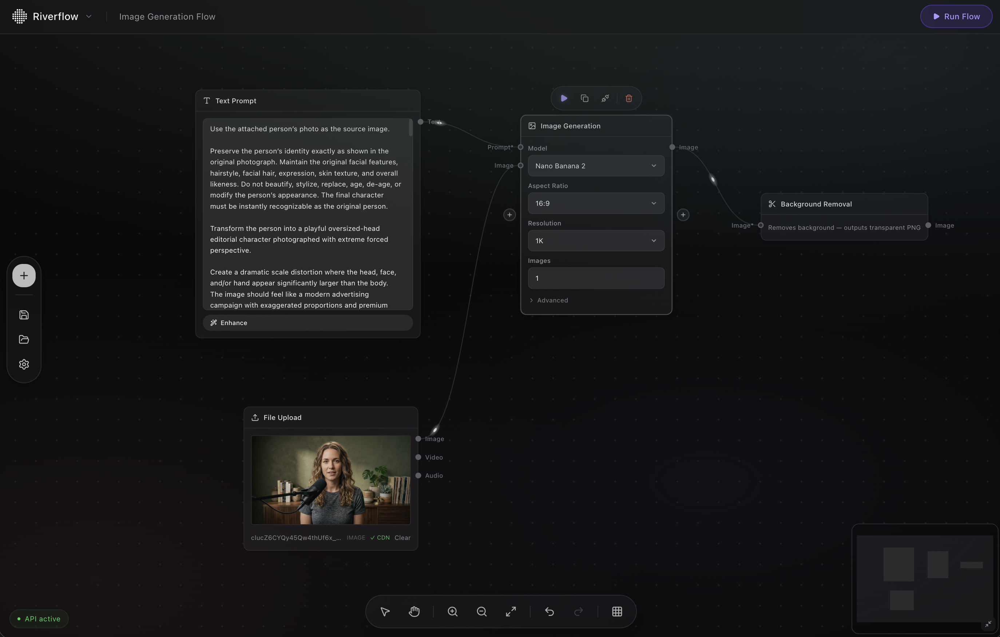

# Riverflow

A visual node canvas for building AI workflows powered by [fal.ai](https://fal.ai). Chain together image generation, video, audio, LLM, and utility nodes into pipelines — no code required.



## Features

- **Visual node editor** — drag, drop, and connect nodes on an infinite canvas
- **fal.ai models** — image gen, video gen, audio gen, image-to-image, upscale, background remove, LLM, and more
- **Real-time execution** — run individual nodes or full flows with live progress
- **Templates** — quick-start flows for common tasks (multi-model compare, image upscale, etc.)
- **Flow management** — save, load, and duplicate flows locally
- **Dark UI** — keyboard shortcuts, undo/redo, snap-to-grid, minimap

## Tech Stack

- [React 18](https://react.dev) + [TypeScript](https://www.typescriptlang.org)
- [Vite](https://vitejs.dev) for bundling
- [@xyflow/react](https://reactflow.dev) for the node canvas
- [@fal-ai/client](https://fal.ai/docs) for AI model execution
- [Zustand](https://zustand-demo.pmnd.rs) for state management
- [Tailwind CSS v4](https://tailwindcss.com)

## Getting Started

### 1. Install dependencies

```bash
npm install
```

### 2. Run the dev server

```bash
npm run dev
```

Open [http://localhost:5173](http://localhost:5173).

### 3. Add your fal.ai API key

Click the **⚙ settings** icon in the sidebar and paste your [fal.ai API key](https://fal.ai/dashboard/keys). Without it, AI nodes won't execute.

## Node Types

| Category | Nodes |
|----------|-------|
| **Input** | Prompt, Image Upload, Number |
| **AI** | Image Gen, Video Gen, Audio Gen, Image-to-Image, Upscale, Background Remove, LLM |
| **Utility** | Merge, Note |
| **Output** | Output viewer |

## Keyboard Shortcuts

| Shortcut | Action |
|----------|--------|
| `Backspace` / `Delete` | Delete selected node |
| `Cmd/Ctrl + Z` | Undo |
| `Cmd/Ctrl + Shift + Z` | Redo |
| `Cmd/Ctrl + K` | Command palette |
| `Space + drag` | Pan canvas |
| `Scroll` | Zoom |

## Scripts

```bash
npm run dev      # Start dev server
npm run build    # Production build
npm run preview  # Preview production build
npm run lint     # Run ESLint
```

## License

MIT
